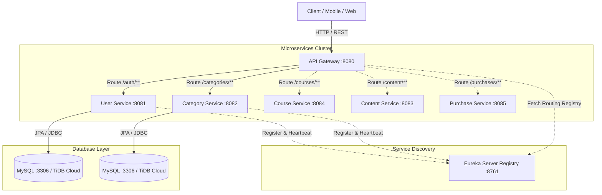

# 🚀 Learnify Microservices Platform

A production-grade, containerized Spring Boot Microservices monorepo designed with enterprise security standards, stateless JWT authentication, service discovery, dynamic API routing, and cloud-native containerization.

---

## 🏗️ Architecture Overview



---

## 📦 Microservices Breakdown

| Service Name | Port | Description | Tech Stack |
| :--- | :--- | :--- | :--- |
| **server-registry** | `8761` | Service discovery & registry | Spring Cloud Netflix Eureka |
| **api-gateway** | `8080` | Unified API entry point, JWT validation & routing | Spring Cloud Gateway, JJWT |
| **user-service** | `8081` | Authentication, user registration, JWT generation, BCrypt | Spring Boot 4, Spring Security, MySQL |
| **category-service** | `8082` | Course category management & admin RBAC | Spring Boot, Spring Data JPA, MySQL |
| **course-service** | `8084` | Course catalog & management | Spring Boot |
| **content-service** | `8083` | Video/material content management | Spring Boot |
| **purchase-service** | `8085` | Enrollment & payment processing | Spring Boot |

---

## 🛡️ Security & Zero-Trust Architecture

- **No Hardcoded Secrets**: All sensitive values (database credentials, JWT secret keys, service URLs) are externalized to environment variables with sensible defaults for local development.
- **Stateless JWT Flow**:
  1. Client sends credentials to `POST /auth/signin`.
  2. `user-service` validates credentials using `BCryptPasswordEncoder` and returns a signed HS256 JWT token with role claims.
  3. Subsequent requests pass through `api-gateway` with `Authorization: Bearer <token>`.
  4. `JwtAuthenticationFilter` validates the signature, extracts user claims (`X-USER-ID`, `X-ROLE`), and injects them into downstream request headers.
  5. Microservices enforce Role-Based Access Control (RBAC) securely without exposing database layers.
- **Container Security**: All Docker containers run as a non-root `spring:spring` user.

---

## ⚡ Quickstart: Local Development

### Prerequisites
- **JDK 17** or higher
- **Maven 3.8+**
- **Docker & Docker Compose** (Optional, for containerized run)

### Option 1: Run with Docker Compose (Recommended - 1 Command)
Run the entire microservice ecosystem, including MySQL and Eureka:

```bash
docker compose up --build
```

Everything will be ready at:
- Eureka Dashboard: [http://localhost:8761](http://localhost:8761)
- API Gateway: [http://localhost:8080](http://localhost:8080)

### Option 2: Build & Run from Source (Maven Monorepo)

1. **Build all modules**:
   ```bash
   mvn clean package -DskipTests
   ```

2. **Start MySQL** (Ensure `newusermicroservicedb` and `newcategorymicroservicedb` exist).

3. **Start services in order**:
   - `server-registry`
   - `user-service`
   - `category-service`
   - `api-gateway`

---

## 🌐 Free-Tier Cloud Deployment Guide

You can deploy this microservices ecosystem for **100% FREE** using modern cloud tiers:

### Step 1: Free Cloud Database (TiDB Cloud MySQL)
1. Go to [TiDB Cloud](https://tidbcloud.com/) and create a free Serverless MySQL cluster (No credit card required).
2. Open the SQL Editor and run:
   ```sql
   CREATE DATABASE IF NOT EXISTS newusermicroservicedb;
   CREATE DATABASE IF NOT EXISTS newcategorymicroservicedb;
   CREATE DATABASE IF NOT EXISTS newpurchasemicroservicedb;
   ```
3. Copy your Host, Port, Username, and Password.

### Step 2: Deploy to Render with 1-Click Blueprint
1. Go to [Render Dashboard](https://dashboard.render.com/).
2. Click **New +** -> **Blueprint**.
3. Connect your GitHub repository `dipeshmalviya/learnify-microservices`.
4. Render will automatically detect [`render.yaml`](file:///c:/Users/malvi/IdeaProjects/Learnify-Microservices-New/render.yaml) and configure:
   - `learnify-user-service`
   - `learnify-category-service`
   - `learnify-purchase-service`
   - `learnify-api-gateway`
5. Supply your TiDB `DB_URL`, `DB_USERNAME`, and `DB_PASSWORD` when prompted.
6. Click **Apply** to deploy the microservices ecosystem for free!

---

## 🧪 API Testing Guide

### 1. Register a New User
```bash
curl -X POST http://localhost:8080/auth \
  -H "Content-Type: application/json" \
  -d '{
    "name": "Jane Doe",
    "email": "jane@example.com",
    "password": "Password@123",
    "role": "ADMIN"
  }'
```

### 2. Sign In & Receive JWT Token
```bash
curl -X POST http://localhost:8080/auth/signin \
  -H "Content-Type: application/json" \
  -d '{
    "email": "jane@example.com",
    "password": "Password@123"
  }'
```

### 3. Create Category (Requires ADMIN Token)
```bash
curl -X POST http://localhost:8080/categories \
  -H "Content-Type: application/json" \
  -H "Authorization: Bearer <YOUR_JWT_TOKEN>" \
  -d '{
    "name": "Cloud Computing",
    "description": "Learn AWS, Docker, and Kubernetes"
  }'
```

### 4. Fetch All Categories (Requires Valid JWT)
```bash
curl -X GET http://localhost:8080/categories \
  -H "Authorization: Bearer <YOUR_JWT_TOKEN>"
```

### 5. Initiate Purchase Checkout (Payment Gateway)
```bash
curl -X POST http://localhost:8080/purchases/checkout \
  -H "Content-Type: application/json" \
  -H "Authorization: Bearer <YOUR_JWT_TOKEN>" \
  -d '{
    "courseId": 101,
    "amount": 49.99,
    "currency": "USD",
    "paymentMethod": "DUMMY_GATEWAY"
  }'
```

### 6. Verify Payment & Unlock Course
```bash
curl -X POST http://localhost:8080/purchases/verify \
  -H "Content-Type: application/json" \
  -H "Authorization: Bearer <YOUR_JWT_TOKEN>" \
  -d '{
    "orderId": 1,
    "transactionId": "TXN_MOCK_XXXXX",
    "simulateStatus": "SUCCESS"
  }'
```

### 7. View User Purchases
```bash
curl -X GET http://localhost:8080/purchases/my-purchases \
  -H "Authorization: Bearer <YOUR_JWT_TOKEN>"
```

---

## 📄 License
This project is licensed under the MIT License.
